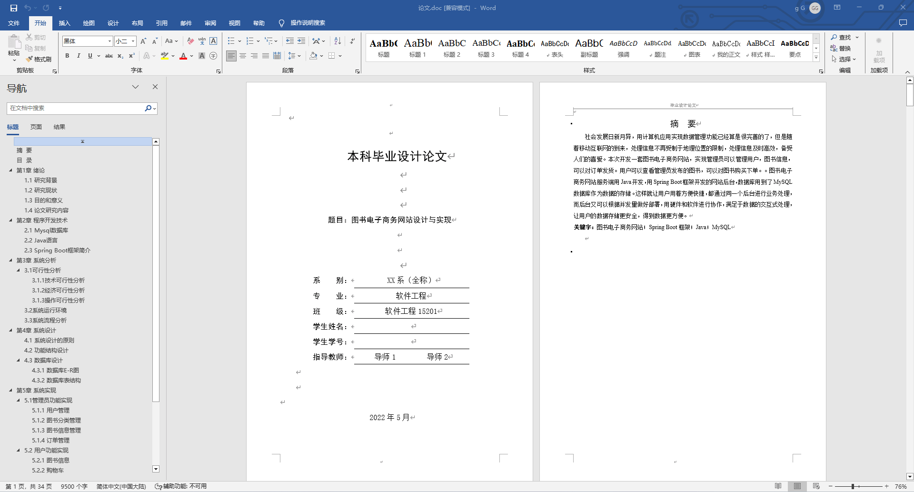
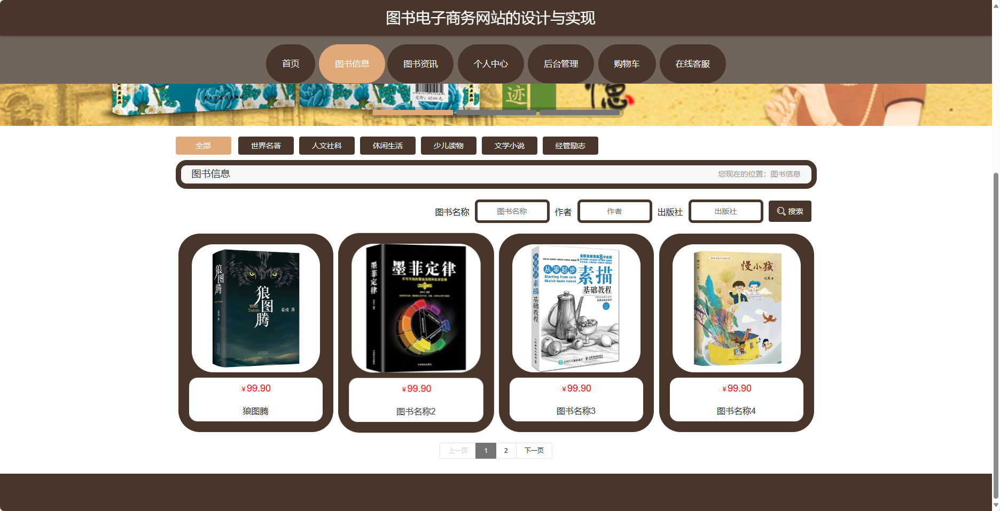
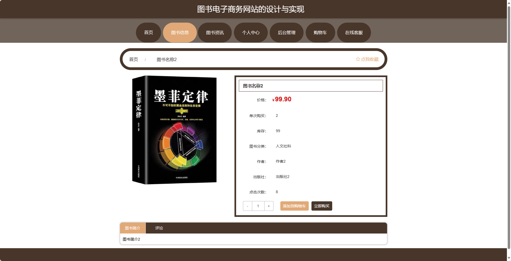
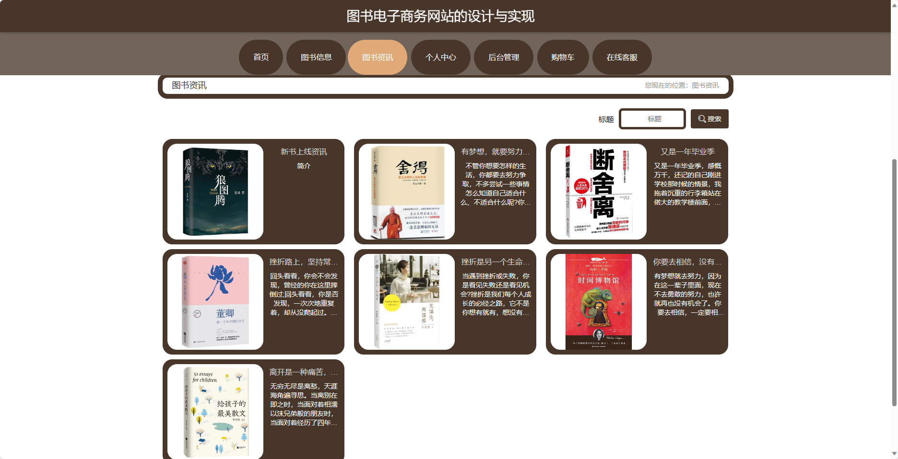
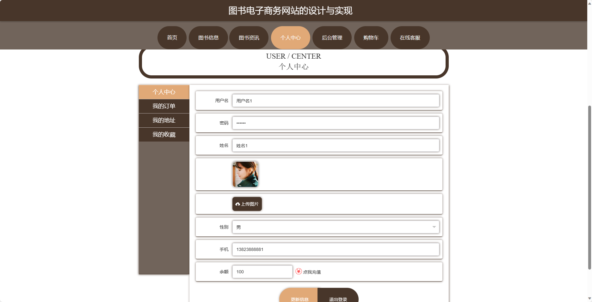
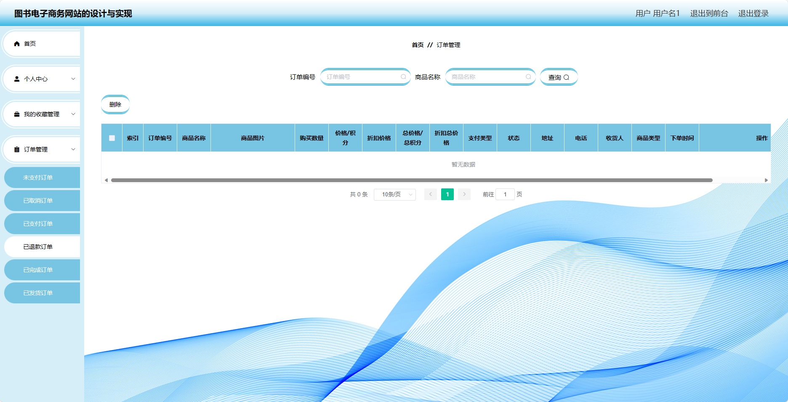
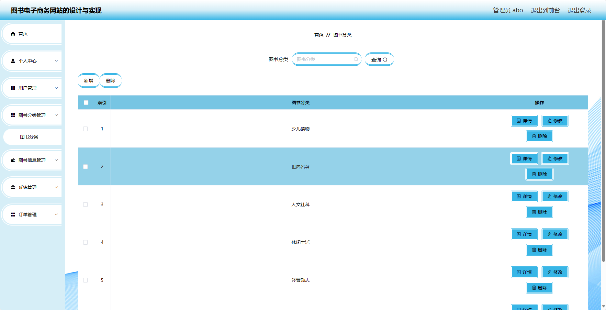
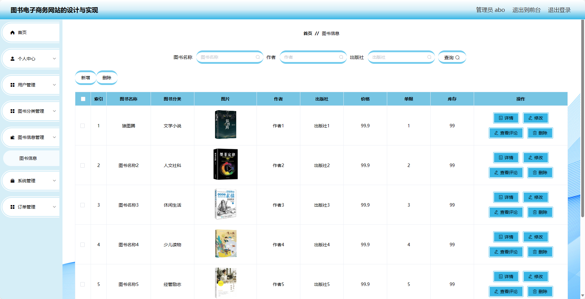
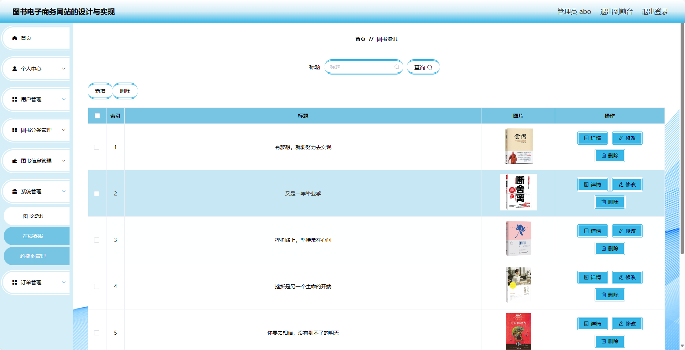

## 基于SpringBoot的图书电子商务网站(程序+报告)

###  获取sql数据库文件: 从戎源码网 (https://armycodes.com/) QQ: 386869957 QQ群: 377586148
###  所有系统地址: (https://github.com/YuLin-Coder/AllProjectCatalog) 
###  所有项目以及源代码本人均调试运行无问题 可支持远程安装部署调试、定制修改、代码讲解

## 项目介绍
基于SpringBoot的图书电子商务网站，系统包含两种角色：管理员、用户,系统分为前台和后台两大模块，主要功能如下。

### 【管理员】:
- 个人中心：管理个人信息。
- 用户管理：管理用户的信息，包括查看用户列表、禁用用户等。
- 图书分类管理：管理图书的分类信息，包括添加、编辑、删除分类。
- 图书信息管理：管理图书的信息，包括添加、编辑、删除图书。
- 系统管理：管理系统的基础数据，如图书标签、出版社等。
- 订单管理：查看和管理用户的订单信息，包括订单列表、订单详情等。

### 【前台】:
- 首页：展示图书电子商务网站的主页信息。
- 图书信息：浏览图书的详细信息，包括图书封面、作者、价格等。
- 图书资讯：查看最新的图书相关资讯。
- 个人中心：管理个人信息，包括修改个人资料、查看订单等。
- 购物车：管理已选购的图书，包括添加、删除、修改数量等操作。
- 在线客服：提供在线客服支持。

### 【用户】:
- 个人中心：管理个人信息。
- 我的收藏管理：管理用户收藏的图书信息，包括添加、删除收藏等操作。
- 订单管理：查看和管理用户的订单信息，包括订单列表、订单详情等。

## 项目技术
- 编程语言：Java
- 数据库：MySQL
- 项目管理工具：Maven
- 前端技术：HTML、CSS、JavaScript、Jquery、Vue
- 后端技术：Spring、SpringMVC、MyBatis

## 运行环境
- JDK版本：JDK1.8及以上
- 开发工具：IDEA、Ecplise、Myecplise都可以
- 数据库: MySQL5.7及以上
- Maven：maven3.0及以上
- Node：14.14.0及以上

## 运行截图

